# Scenario Configuration Reference

This guide describes how to configure YAML scenarios for generating realistic telemetry data. Scenarios support probabilistic behavior, realistic distributions, correlated error patterns, and retry sequences.

## Overview

Scenarios are defined in YAML files. The simulator includes **sample definitions** in `src/simulator/scenarios/definitions/`; you can use those or point to a custom folder with `--scenarios-dir`. Each scenario describes:

- **Trace structure** - Hierarchy of spans (parent-child relationships). Supported span types include `{prefix}.a2a.orchestrate`, `{prefix}.planner`, `{prefix}.task.execute`, `{prefix}.llm.call`, `{prefix}.mcp.tool.execute`, `{prefix}.response.compose`, and others (see [Generating Telemetry](./generating-telemetry.md)).
- **Latency distributions** - How long each span takes
- **Error behavior** - Error rates and propagation patterns
- **Probabilistic features** - Variable span inclusion, counts, and retries
- **Attributes** - Static values or sampled from distributions (use `vendor.*` in YAML; the loader normalizes to `TELEMETRY_SIMULATOR_ATTR_PREFIX`)

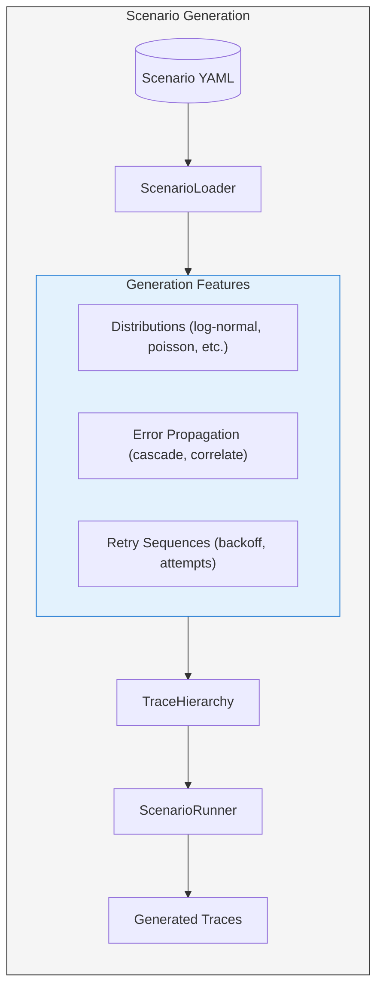

---

## Latency Configuration

### Basic Latency

Simple latency with mean and variance:

```yaml
latency:
  mean_ms: 200
  variance: 0.3    # ±30% variation
```

### Log-Normal Distribution (Recommended)

Real-world latencies are right-skewed: most requests are fast, but some take much longer. Log-normal captures this naturally.

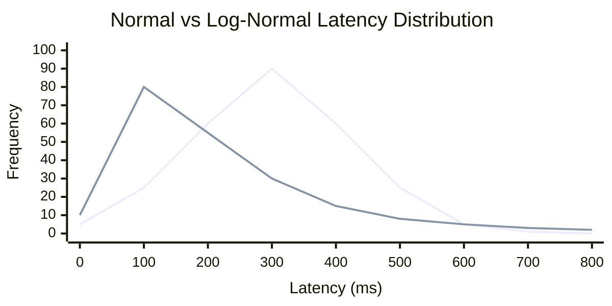

**Legend:** Blue = **Normal** (mean=200 ms). Green = **Log-Normal** (median=200 ms).

```yaml
latency:
  distribution: log_normal
  median_ms: 200      # 50th percentile
  sigma: 0.8          # Shape parameter
                      # - 0.5: tight, ~90% within 2x of median
                      # - 0.8: moderate spread
                      # - 1.2: heavy tail
```

#### Sigma Parameter Effect

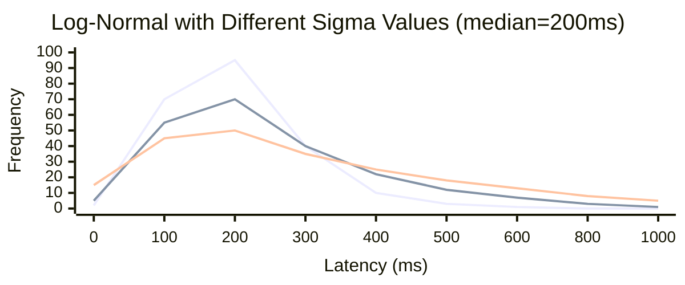

**Legend:** Blue = **sigma 0.5** (tight). Orange = **sigma 0.8** (moderate). Green = **sigma 1.2** (heavy tail).

### Mixture Distribution (Bimodal)

Model cache hit/miss or fast path/slow path scenarios:

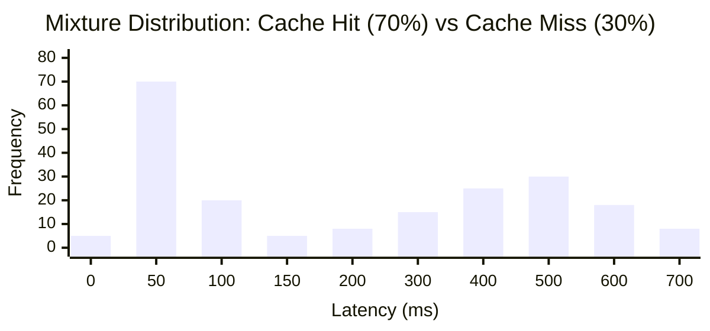

```yaml
latency:
  distribution: mixture
  components:
    - weight: 0.7
      distribution: normal
      mean: 50          # Cache hit (fast)
      stddev: 10
    - weight: 0.3
      distribution: log_normal
      median: 500       # Cache miss (slow)
      sigma: 0.6
```

---

## Available Distributions

| Distribution | Use Case | Parameters |
|--------------|----------|------------|
| `normal` | Symmetric variations | `mean`, `stddev` |
| `log_normal` | Latencies (right-skewed) | `median`, `sigma` |
| `exponential` | Inter-arrival times | `mean` |
| `uniform` | Random in range | `low`, `high` |
| `poisson` | Event counts | `lambda` |
| `geometric` | Trials until success | `p` |
| `categorical` | Discrete choices | `values` (dict of value→weight) |
| `mixture` | Multi-modal behavior | `components` (list of distributions) |

---

## Probabilistic Spans

Control whether spans appear in each trace using `probability`:

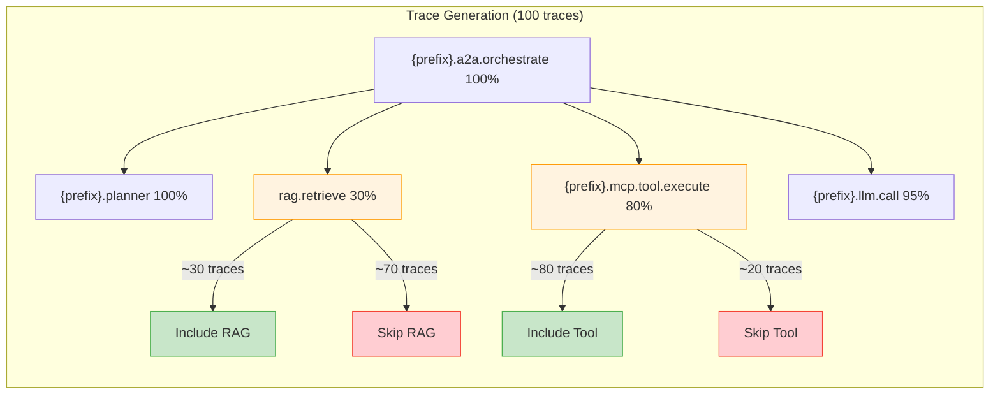

```yaml
children:
  - type: rag.retrieve
    probability: 0.3    # Only 30% of traces include RAG
    
  - type: vendor.mcp.tool.execute
    probability: 0.8    # 80% include tool call
```

---

## Count Distributions

Generate variable numbers of child spans:

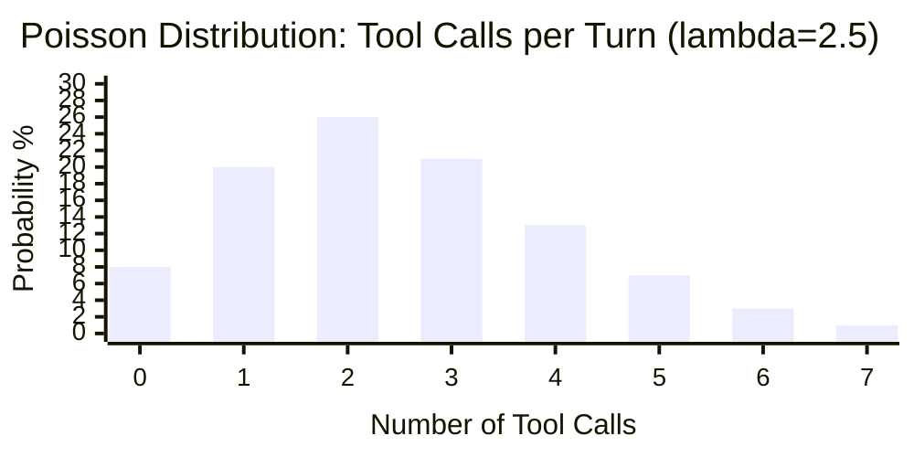

```yaml
children:
  - type: vendor.mcp.tool.execute
    count:
      distribution: poisson
      lambda: 2.5       # Average 2.5 tool calls per turn
      min: 1            # At least 1
      max: 5            # At most 5
```

Or simple range:

```yaml
children:
  - type: vendor.mcp.tool.execute
    count:
      min: 1
      max: 3            # Random 1-3 tool calls
```

---

## Error Configuration

### Basic Error Rate

```yaml
error:
  rate: 0.05           # 5% error rate
```

### Error Propagation

Model realistic error cascades through the trace hierarchy:

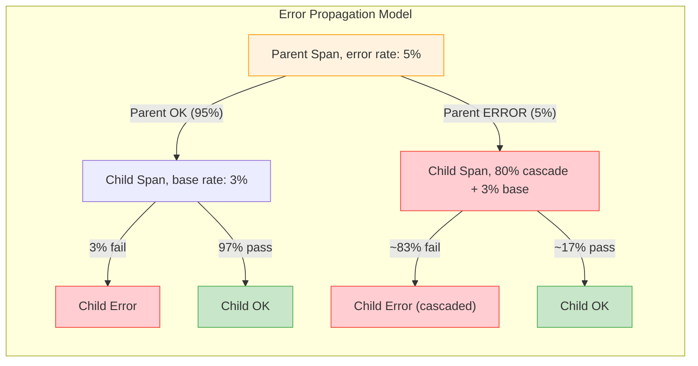

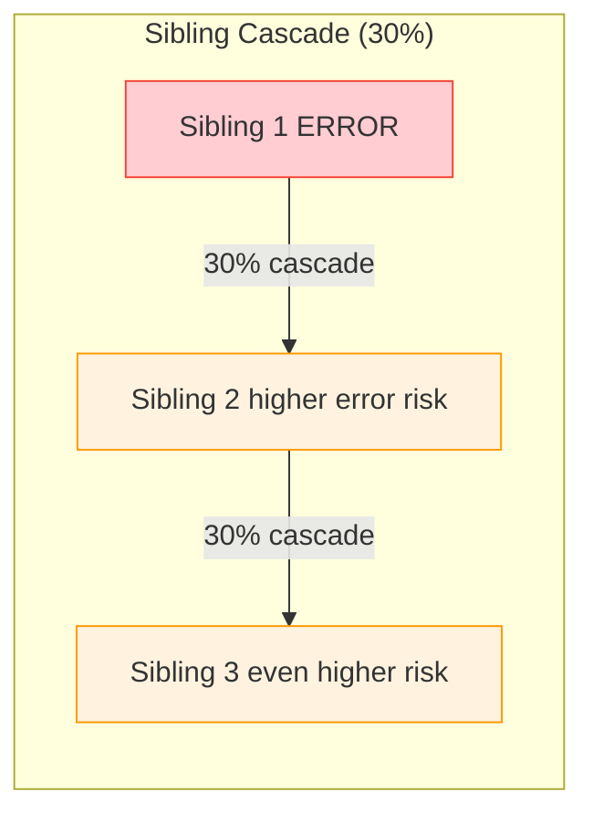

```yaml
error:
  rate: 0.05           # Base error rate (5%)
  types:
    - timeout
    - upstream_5xx
    - rate_limit
  propagation:
    from_parent: 0.8   # 80% chance child fails if parent failed
    cascade_to_siblings: 0.3  # 30% chance sibling fails if one fails
```

### Error Types

| Error Type | Description |
|------------|-------------|
| `timeout` | Request timeout |
| `validation` | Input validation failure |
| `upstream_5xx` | Upstream service error |
| `rate_limit` | Rate limiting |
| `auth_failure` | Authentication/authorization failure |
| `not_found` | Resource not found |
| `internal_error` | Internal server error |

---

## Retry Behavior

Model operations that retry on failure:

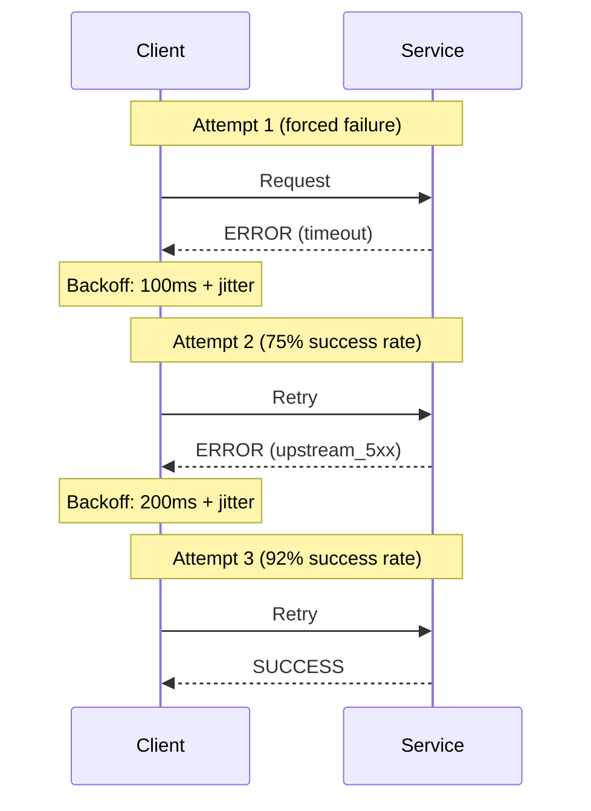

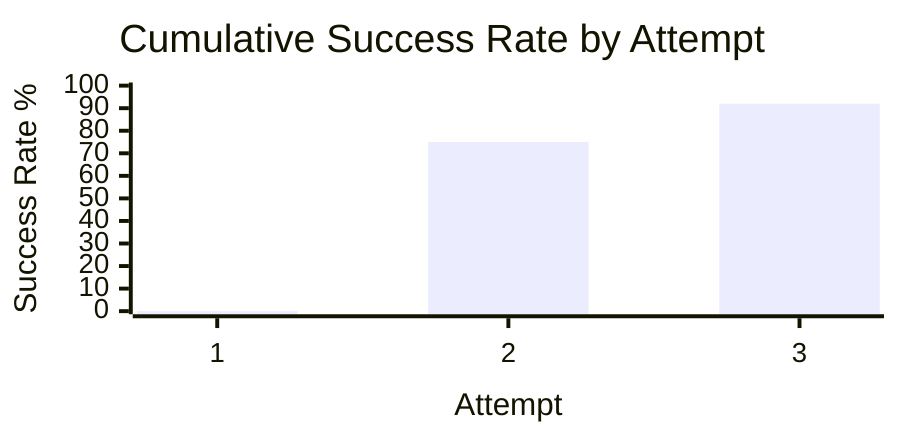

```yaml
retry:
  enabled: true
  max_attempts: 3
  force_initial_failure: true   # First attempt always fails
  backoff_base_ms: 100
  backoff_multiplier: 2.0       # Exponential backoff
  backoff_jitter: 0.2           # ±20% jitter on backoff
  success_rate_per_attempt:
    - 0.0    # Attempt 1: 0% success (forced failure)
    - 0.75   # Attempt 2: 75% success
    - 0.92   # Attempt 3: 92% success
```

### Exponential Backoff with Jitter

```mermaid
---
config:
  xyChart:
    width: 500
    height: 220
---
xychart-beta
    title "Exponential Backoff Timing (base=100ms, multiplier=2x)"
    x-axis "Retry Attempt" [1, 2, 3, 4]
    y-axis "Backoff (ms)" 0 --> 1000
    bar "Min (with -20% jitter)" [80, 160, 320, 640]
    bar "Base" [100, 200, 400, 800]
    bar "Max (with +20% jitter)" [120, 240, 480, 960]
```

**Legend:** Blue = **Min** (−20% jitter). Orange = **Base**. Green = **Max** (+20% jitter).

### Retry Attributes

Retry scenarios automatically add these span attributes:

| Attribute | Description |
|-----------|-------------|
| `retry.attempt` | Attempt number (1, 2, 3...) |
| `retry.is_retry` | `true` if attempt > 1 |
| `error.type` | Error type if attempt failed |

---

## Attribute Configuration

### Static Attributes

```yaml
attributes:
  gen_ai.operation.name: chat
  vendor.tool.system: mcp
```

### Distributed Attributes

Generate attribute values from distributions:

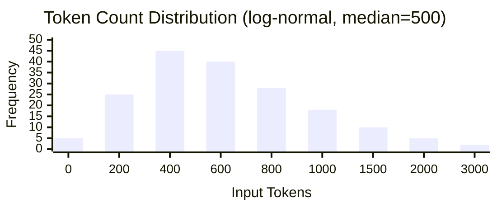

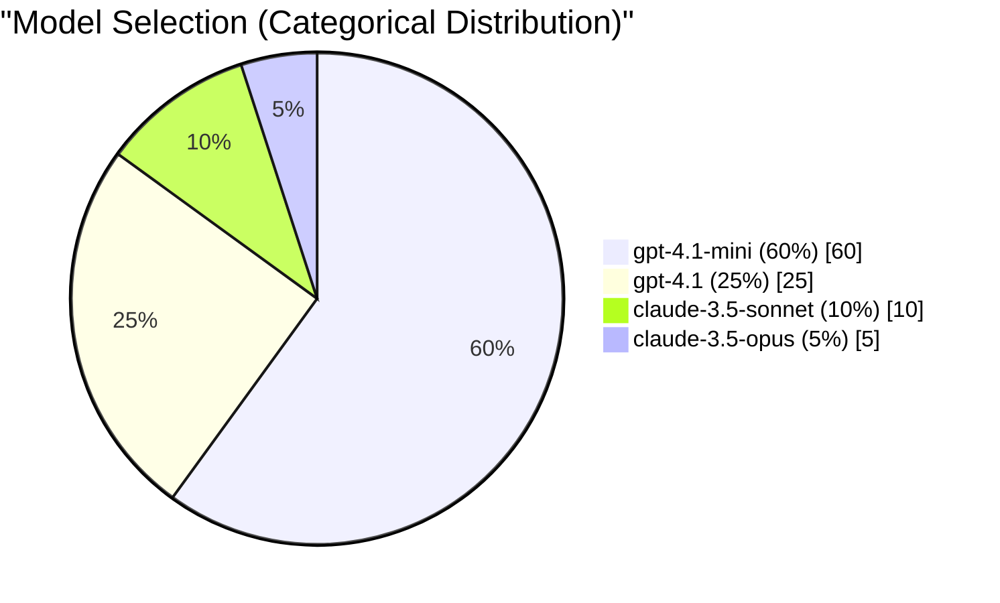

```yaml
attributes:
  # Static attribute
  gen_ai.operation.name: chat
  
  # Distributed attribute (log-normal)
  gen_ai.usage.input_tokens:
    distribution: log_normal
    median: 500
    sigma: 0.8
    
  # Distributed attribute (categorical)
  gen_ai.request.model:
    distribution: categorical
    values:
      gpt-4.1-mini: 0.60
      gpt-4.1: 0.25
      claude-3.5-sonnet: 0.10
      claude-3.5-opus: 0.05
```

---

## Complete Example: Tool Retry Scenario

The `tool_retry.yaml` scenario demonstrates all features:

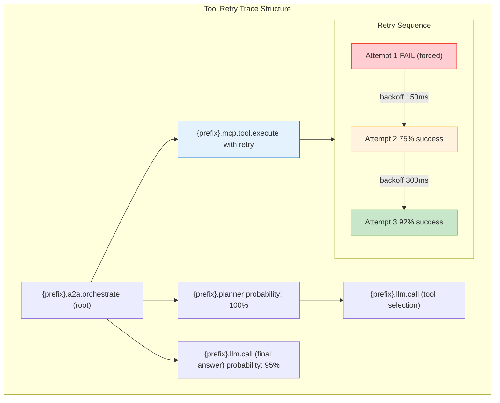

```yaml
name: tool_retry
description: >
  MCP tool call that fails on first attempt and succeeds after retry.

tags:
  - retry
  - failure
  - recovery

repeat_count: 50
interval_ms: 750

emit_metrics: true
emit_logs: true

root:
  type: vendor.a2a.orchestrate
  latency:
    distribution: log_normal
    median_ms: 2500
    sigma: 0.4
  error:
    rate: 0.05
    propagation:
      from_parent: 0.7
      cascade_to_siblings: 0.2

  children:
    - type: vendor.planner
      probability: 1.0
      latency:
        distribution: log_normal
        median_ms: 350
        sigma: 0.3
      children:
        - type: vendor.llm.call
          latency:
            distribution: log_normal
            median_ms: 450
            sigma: 0.5
          attributes:
            gen_ai.usage.input_tokens:
              distribution: log_normal
              median: 400
              sigma: 0.6

    - type: vendor.mcp.tool.execute
      latency:
        distribution: log_normal
        median_ms: 250
        sigma: 0.6
      error:
        rate: 0.8
        propagation:
          from_parent: 0.3
      retry:
        enabled: true
        max_attempts: 3
        force_initial_failure: true
        success_rate_per_attempt: [0.0, 0.75, 0.92]
      attributes:
        gen_ai.tool.name: database.query
        vendor.tool.system: mcp

    - type: vendor.llm.call
      probability: 0.95
      latency:
        distribution: log_normal
        median_ms: 650
        sigma: 0.4
```

### Running the Scenario

```bash
# Run 50 traces with retry behavior
telemetry-simulator scenario --name tool_retry --count 50

# Show full span output including retry attributes
telemetry-simulator scenario --name tool_retry --count 10 --show-full-spans
```

---

## Combining All Features

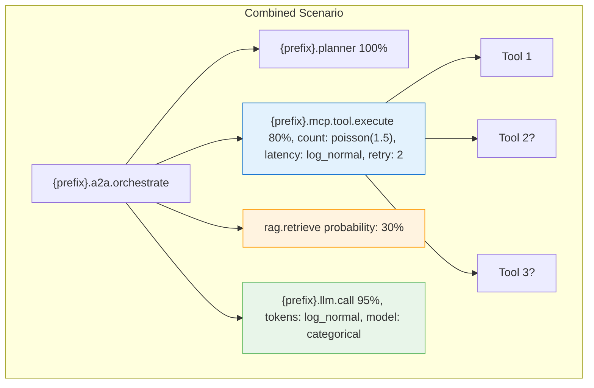

```yaml
children:
  - type: vendor.mcp.tool.execute
    probability: 0.8              # 80% of traces
    count:
      distribution: poisson
      lambda: 1.5                 # Avg 1.5 calls
    latency:
      distribution: log_normal
      median_ms: 200
      sigma: 0.5
    error:
      rate: 0.1
      propagation:
        from_parent: 0.6
    retry:
      enabled: true
      max_attempts: 2
    attributes:
      gen_ai.tool.name:
        distribution: categorical
        values:
          database.query: 0.5
          http.request: 0.3
          file.read: 0.2
```

---

## Architecture

### Module Structure

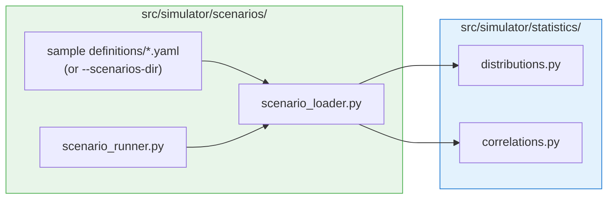

### Key Classes

| Class | Purpose |
|-------|---------|
| `Distribution` | Base class for all distributions |
| `DistributionFactory` | Creates distributions from YAML config |
| `ErrorPropagation` | Models correlated errors |
| `RetryConfig` | Retry behavior settings |
| `RetrySequence` | Generates multi-attempt sequences |
| `ScenarioStep` | Span config with all generation features |
| `ScenarioLoader` | Parses YAML into scenarios |

---

## Best Practices

1. **Use log-normal for latencies** - More realistic than normal/Gaussian
2. **Set realistic sigma values** - 0.5-1.0 for moderate spread
3. **Model error propagation** - Real systems have correlated failures
4. **Start simple** - Add distributions and features incrementally
5. **Test with small counts first** - Verify behavior before large runs
6. **Use tags** - Organize scenarios by purpose (baseline, failure, load-test)

---

## See Also

- [Generating Telemetry](./generating-telemetry.md) - Quick start and examples
- [README](../README.md) - CLI reference and pipeline integration
- [successful_agent_turn.yaml](../src/simulator/scenarios/definitions/successful_agent_turn.yaml) - Sample baseline scenario
- [tool_retry.yaml](../src/simulator/scenarios/definitions/tool_retry.yaml) - Sample retry scenario
- Use `--scenarios-dir` to load scenarios from a custom folder
